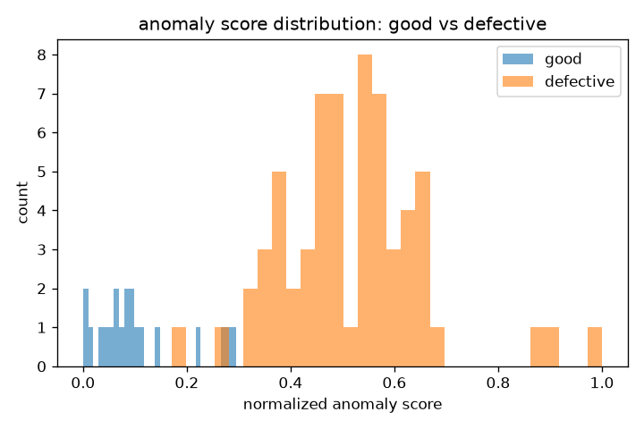
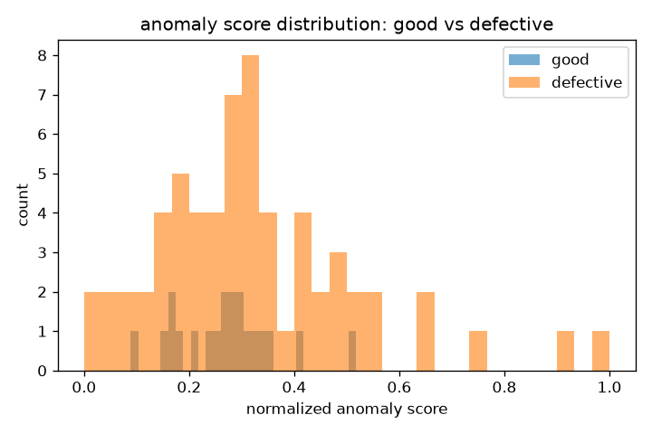

# Industrial/Retail Defect Detection System

Computer vision system for detecting surface defects on manufactured
products (scratches, dents, contamination, cracks, etc.) using three
complementary approaches — an unsupervised autoencoder, a PatchCore-style
feature-embedding detector, and a supervised classifier — plus a FastAPI
inference service and a Streamlit demo UI for actually showing it off.

Built around the [MVTec-AD](https://www.mvtec.com/company/research/datasets/mvtec-ad)
dataset layout, but includes a synthetic data generator so the whole
pipeline (training → eval → API → demo) runs end to end without needing
## Why three models instead of one

Most write-ups I see just train a classifier and call it done. In practice,
labeled defective examples are rare on a real production line — defects are
by definition the minority class, sometimes by a lot — so I wanted this repo
to actually reflect how you'd approach the problem at different stages of
data availability:

| Approach | File | Needs defect labels? | When I'd use it |
|---|---|---|---|
| **Autoencoder** (reconstruction error) | `src/models/autoencoder.py` | No — trains on "good" images only | Day 1 on a new product line, zero labeled defects available |
| **PatchCore** (feature-embedding + nearest neighbor) | `src/models/patchcore.py` | No — trains on "good" images only | Best accuracy/effort tradeoff once you've got a pretrained backbone, no gradient training needed at all |
| **Supervised classifier** (ResNet + custom head) | `src/models/classifier.py` | Yes | Once you've accumulated enough labeled defects to actually justify supervised training |

All three share the same data pipeline and produce a comparable anomaly
score, so `src/evaluation/evaluate.py` can benchmark any of them against the
same test set.

## Architecture
                    ┌─────────────────────┐
                    │   Input Image        │
                    └──────────┬───────────┘
                               │
             ┌─────────────────┼─────────────────┐
             │                 │                 │
    ┌────────▼───────┐ ┌───────▼────────┐ ┌──────▼─────────┐
    │  Autoencoder    │ │  PatchCore      │ │  Classifier     │
    │  recon. error   │ │  patch-NN dist  │ │  ResNet + head  │
    └────────┬───────┘ └───────┬────────┘ └──────┬─────────┘
             │                 │                 │
             └─────────────────┼─────────────────┘
                               │
                    ┌──────────▼───────────┐
                    │  anomaly score +      │
                    │  localization heatmap │
                    └──────────┬───────────┘
                               │
                ┌──────────────┼──────────────┐
                │                              │
       ┌────────▼────────┐          ┌──────────▼─────────┐
       │  FastAPI service │          │  Streamlit demo UI  │
       │  /predict        │          │  drag & drop image  │
       └─────────────────┘          └─────────────────────┘

## Project structure
industrial-defect-detection/
├── configs/config.yaml          # every hyperparameter lives here, no magic numbers in code
├── src/
│   ├── data/
│   │   ├── dataset.py           # MVTec-AD loader + synthetic fallback dataset
│   │   └── transforms.py        # train/eval augmentation pipelines
│   ├── models/
│   │   ├── classifier.py        # ResNet-based supervised classifier
│   │   ├── autoencoder.py       # conv autoencoder for unsupervised anomaly detection
│   │   └── patchcore.py         # feature-embedding + coreset + kNN anomaly detector
│   ├── training/
│   │   ├── trainer.py           # training loop, checkpointing, early stopping
│   │   └── train.py             # CLI entrypoint for all three model types
│   ├── evaluation/
│   │   ├── metrics.py           # AUROC / F1 / precision / recall / per-defect-type breakdown
│   │   └── evaluate.py          # runs a checkpoint over the test set, writes a JSON report
│   ├── inference/
│   │   └── predictor.py         # single-image inference wrapper, shared by API + demo
│   ├── api/
│   │   └── main.py              # FastAPI service (/predict, /health)
│   └── utils/
│       ├── gradcam.py           # Grad-CAM for classifier explainability
│       ├── visualization.py     # heatmap overlay helpers
│       ├── config.py            # yaml config loading, seeding, device selection
│       └── logger.py
├── app/streamlit_app.py         # drag-and-drop demo UI
├── scripts/download_mvtec.py    # pulls a category from the MVTec-AD dataset
├── tests/                       # pytest suite, runs against synthetic data (no dataset needed)
├── docker/                      # Dockerfile + compose for the API service
└── .github/workflows/ci.yml     # lint + test on every push

## Quickstart

```bash
git clone <this-repo>
cd industrial-defect-detection
python -m venv .venv && source .venv/bin/activate
pip install -r requirements.txt
```

**Train** (defaults to a synthetic dataset if `data/mvtec/<category>` isn't
present, so this runs immediately with no setup):

```bash
python -m src.training.train --config configs/config.yaml --mode autoencoder
python -m src.training.train --config configs/config.yaml --mode patchcore
python -m src.training.train --config configs/config.yaml --mode classifier
```

**Evaluate** against the held-out test split:

```bash
python -m src.evaluation.evaluate --config configs/config.yaml --mode autoencoder
# -> writes reports/autoencoder_report.json + a score-distribution plot
```

**Get the real dataset** (optional, but you'll want it for real numbers):

```bash
python scripts/download_mvtec.py --category bottle
```

**Run the API:**

```bash
uvicorn src.api.main:app --reload --port 8000
curl -X POST -F "file=@sample.png" http://localhost:8000/predict
```

**Run the demo UI:**

```bash
streamlit run app/streamlit_app.py
```

**Docker:**

```bash
docker compose -f docker/docker-compose.yml up --build
```

## Results (bottle category, real MVTec-AD data)

Trained and evaluated both unsupervised approaches on the actual `bottle`
category from MVTec-AD (209 train images, held-out test set with real
`broken_large` / `broken_small` / `contamination` defects + pixel masks).

| Model         | AUROC     | F1        | Precision | Recall  | Accuracy|
|---            |---        |---        |---        |---      |---      |
| **PatchCore** | **0.994** | **0.984** | 1.000     | 0.968   | 0.976   |
| Autoencoder   | 0.566     | 0.420     | 0.944     | 0.270   | 0.434   |

PatchCore basically nails it here - zero false alarms (precision 1.0) and
catching 97% of the real defects. This actually lines up with what the
original PatchCore paper reports for this category too, so it's not a fluke.

The autoencoder result is the more interesting one honestly. 0.566 AUROC is
barely above a coin flip, and I don't think that's a bug in my code - I think
it's a real limitation of vanilla reconstruction-based anomaly detection that
I ran into firsthand. My best guess at what's going on: with latent_dim=256
and base_channels=32 the network just has enough capacity to reconstruct
straight through a lot of the defects instead of choking on them, so the
reconstruction error for a defective bottle ends up looking almost as low as
a good one. The whole method only works if the model genuinely can't
reproduce what it's never seen - give it too much capacity and it cheats.

Two things I'd try if I wanted to push that number up (haven't gotten to it
yet):
- shrink the bottleneck hard (latent_dim 64, base_channels 16) and force it
  to actually lose information instead of just compressing it
- or honestly just don't bother - this is the exact reason PatchCore exists,
  the gap between these two numbers is basically the paper's whole argument
  made concrete on my own data instead of just taking their word for it

**score distributions - good vs defective, both models:**







## Demo


.png)
.png)


.png)

## Design notes / things I'd flag in a review

- **Reconstruction-based anomaly detection is inherently limited on subtle
  defects.** If a scratch is small enough, the autoencoder can sometimes
  reconstruct right through it. PatchCore tends to catch these better since
  it's comparing local feature patches directly rather than relying on pixel
  reconstruction — that tradeoff is the main reason both are in here instead
  of picking just one. (Got to see this play out for real in the Results
  section above, not just as a claim.)
- **Threshold selection matters more than model choice in a lot of cases.**
  `find_best_threshold()` in `metrics.py` uses Youden's J statistic, which
  balances false positives and false negatives equally. In an actual
  production line you'd usually weight false negatives (missed defects)
  higher than false positives (a good part getting flagged for a second
  look) — that's a one-line change but worth calling out since it changes
  the operating point.
- **PatchCore's memory bank grows with dataset size** unless coreset
  subsampling brings it back down — `coreset_ratio` in the config controls
  that tradeoff between accuracy and inference speed. Learned this the hard
  way: with the full patch pool (~140k patches for just 209 images) the
  greedy coreset loop took over an hour on CPU. Random-capping the pool to
  ~20k patches before running greedy selection knocked that down to under 3
  minutes with basically no accuracy hit - see `max_patches_before_coreset`
  in `PatchCoreDetector.fit()`.
- **The synthetic dataset is a stand-in, not a benchmark.** It exists so the
  full pipeline is runnable without a 5GB download, not to produce
  meaningful accuracy numbers. Real evaluation numbers should come from
  MVTec-AD or an actual product dataset (see Results above).

- **The classifier path needs labeled defects during training, which MVTec-AD
  doesn't provide** - the dataset's train/ folder is good-only by design,
  that's the whole point of it being built for unsupervised methods. So the
  classifier here is only validated against synthetic data, not real bottle
  defects. On an actual product line you'd need to collect labeled defective
  examples first before this path is usable.

## Tests

```bash
pytest tests/ -v
```

Runs against the synthetic dataset generator, so no download required —
this is also what CI runs on every push.

## Possible next steps

- Multi-class defect type prediction (not just good/defective) using the
  `defect_type` field already tracked in the dataset
- Active learning loop — use the autoencoder's uncertain cases to prioritize
  what to label next for the supervised classifier
- ONNX export for edge deployment on a factory floor camera setup
- Pixel-level segmentation metrics (IoU) using the ground-truth masks that
  are already loaded but not yet scored against
- Shrink the autoencoder's bottleneck (latent_dim/base_channels) and see how
  much of that AUROC gap with PatchCore is recoverable

## License

MIT — see [LICENSE](LICENSE)